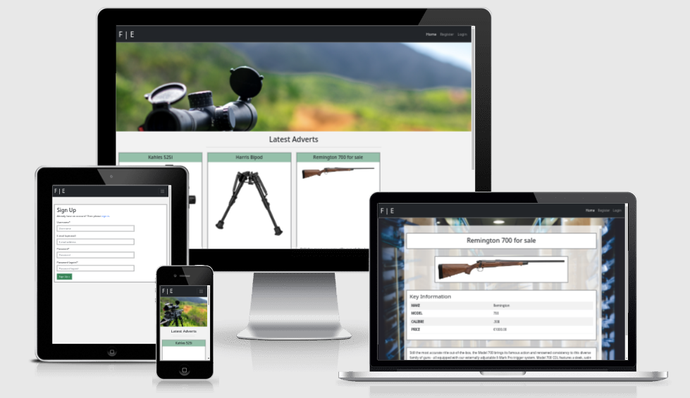
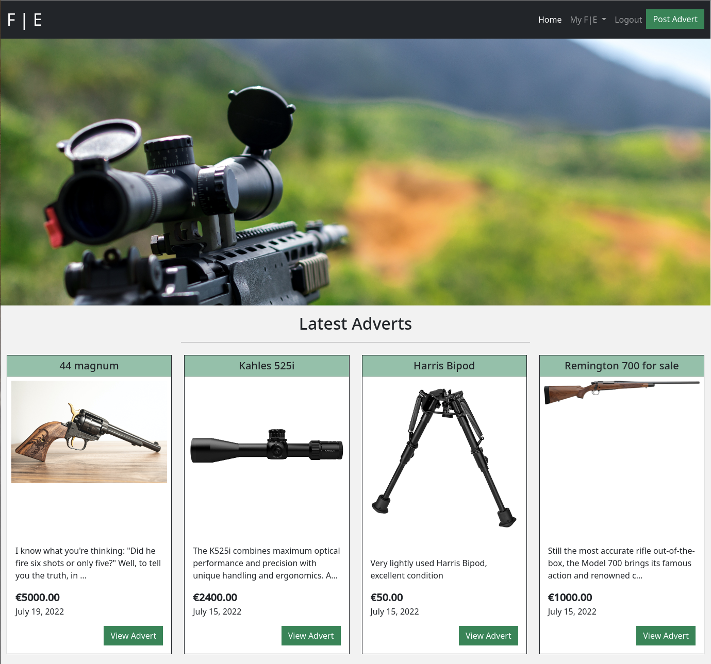
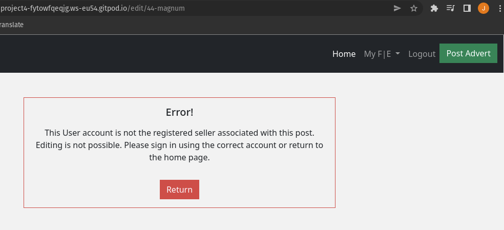
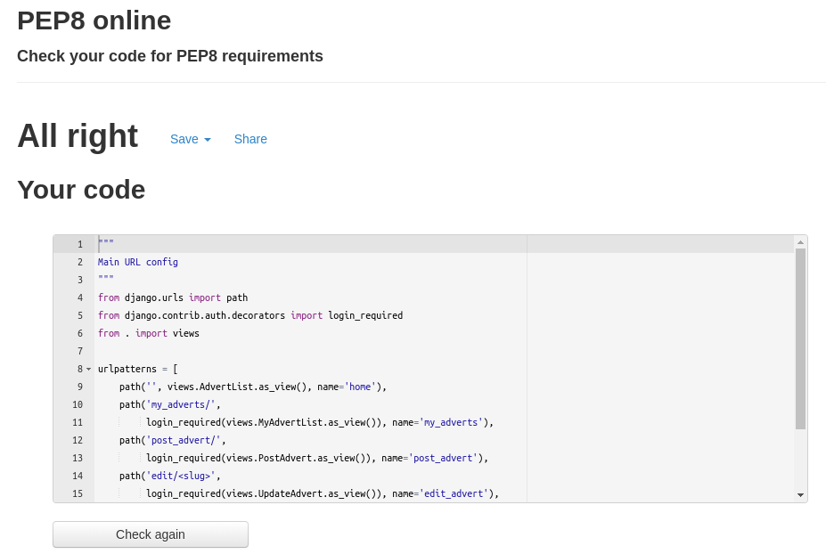

# Firearm Exchange Classified Advert Website

Firearm Exchange is a fully-functioning, interactive web application biuilt using django, postgresql, bootstrap and deployed to heroku. People who participate in Precision Rifle Series can use the web application to trade and sell firearms. Precision Rifle Series is a rifle-based shooting sport that has championship style competitiors. Points can be collected from competitions and is a hobby enjoyed by people across the world. Of course, there are other competitive shooting sports that can also gain benefit from using the web application. Users can log-in, sign-up, post an advert and use contact information on an advert to commumicate with the seller. An agreenment can be made between the seller and buyer. Currently, web applications that fit into this category are few and far between. The web application is not limited to firearms, but scopes, accessories and ammunition can be traded as well. 

The live link can be found here - https://firearmexchange.herokuapp.com/

Initial brainstorming, planning and pitch of the web application: 

 

AmIResponsive snip

 

## How to use the Web Application

The web application is used by users who wish to view adverts for firearm equipment, accessories, optics and ammunition. If the user wishes to post an advert to potentially sell or trade their item, they will need to create an account. This is done by clicking the "Register" button in the right hand corner of the header. Once done so, the user can log into their account and post an advert. Contact details should be inserted into the advert so that potential buyers can contact the seller. Once logged in, registered users can view their own adverts while also looking at adverts from other sellers. 

## Features

### Existing Features

- **User Walkthrough**

The user is greeted with the home page intially. The header contains the logo on the left hand side, which if clicked brings the user back to the homepage. On the right hand side of the header we have "Home", which if clicked brings the user to the homepage. Not every user will be aware that the logo could also bring them back to the homepage, ergo, the "Home" button was implemented. 

Next to the "Home" button is the "Register" button. If "Register" is clicked, the following page is displayed: 

Next to the "Register" button is the "Login" button when clicked looks like the image below:

To create an account with Firearm Exchange, simply click "Register" and fill out the required information. See image below for guidance:

Once Registration information is filled in, click the green "Sign Up" button. Now that an account has been created, clicking the "Login" button and filling out the same information used to register the account will allow us to sign into the account. Once the screen looks like the image below, you are ready to sign in to the account by clicking the green "Sign In" button.

After logging into the account, the header will then look like the below image:

On the right hand side, the "Home" button is still present and will bring you to the homepage of the web application. Next to that is a drop down menu named "My F|E". If clicked this will display the following option:

If "My Advert" is clicked on, this will bring the web application user to the accounts list of posted adverts on Eirearm Exchange. Since this account does not have any listed adverts, this page is blank for now. 

And with a populated list.

Next to the "My F|E" drop down menu is the "Logout" button. If clicked this will promptly log the user out of their account. This Button only appears if the user is logged into the web application. Next to the "Logout" button is the green "Post Advert" button. If clicked, it will bring the user to this page: 

If All of the information is filled out, the web application user can click "Post Advert". This will allow the user to post an advert about their item that they wish to sell or trade. See the image below as an example:

Once information is filled in to the users desire, the advert can be posted by clicking the green button "Post Advert".

Adverts are then used to populate the "Latest Adverts" list on the home page.

- **Back End**

  - The main data structure used in this application is the Advert Model. This is then used to populate a form, which in turn is rendered to the user via a view, and a template, and allows them to create an advert. The index page populates a list of all Advert objects in the databse sorting by most recently created. 

  - The My Adverts page allows users to view their own posted adverts with the option to edit or delete as required. Thus full CRUD functionality is implemented.

### Features Left to Implement

- A Search bar was orginally planned to be in the project. This would allow the user of the web application to search for desired adverts and find what they were looking for with ease. Time did not permit this feature to be fully implemented. 

- A messaging system was attempted to implement into the web application. The purpose was to allow user to user private interaction. This would allow communication between potential buyers and sellers. After much effort, tutoring support said the task would be too complicated and insinuated that it would be best to leave this feature on the back burner. 

- A tag system. Tags would appear at the bottom of an advert that a seller could decide on. If the advert was about an optics item, they could tag the bottom of the advert page with #opticalequipment and that would allow users who use similar words with the search function to ping the advert not only through words used, but also tags. 

- A commenting system on the advert. This was attempted, and followed the tutorial provided by the module but actually getting it to be fully working was just out of my grasp. I would be reminded by tutoring support that I should go to my mentor with this issue, but when doing so, my mentor would tell me to go to tutoring support. The full circle process would take hours. 

## Testing
No automatic testing was performed, however the application has been stringently tested manually. Testing was carried out both on development enviroment initially and live site post deployment. The details of which are:

- CRUD functionality has been tested by myself and others and has been found to be functioning as intended, users are able to create advert instances, this has been verified through admin. Users are able to both edit and delete their own created adverts, and all forms are working. Login required has been imported and implemented in order to restrict access to this functionality to non logged in site users. An if statement on the edit and delete advert templates makes it impossible for a user to edit or delete an advert that does not belong to them. The application previously had a bug where this was possible but has been rectified as previously stated.

 
- The user account functionality comes from allauth and this has been fully tested and working as intended. Users can create an account using an email address, username, and password and upon email verification they are able to sign in and access that part of the site. Users are able to post adverts, as well as edit and delete their own adverts, users are not able to access the edit and delete functionality for ads for which they are not registered as the 'seller'. This has been tested by creating various accounts and attempting to access various parts of the site the user doesn't have permission to enter. Originally, no email verication was required but a connection error was being encountered upon new account registration and so mandatory email verification as per django/allauth docs was implemented.

- The site is fully responsive and this has been verified both through dev tools and on various mobile devices, both in development and production.

- The hero image as well as some media was not displaying, this was rectified by a combination of refactored code both in templates and css. If statements were added to templates to allow use of workspace media context processor whike in development or cloudinary urls in production. Static css media background were changed to cloudinary urls. 

- Previously forms were left unstyled due to time constraints. This was sloppy and has been rectified by utilising crispy forms. All forms are working as intended and have been tested by the creation, editing, and deletion of numerous adverts using different accounts. Form validation has been similarly tested and found functioning as intended.

- Before submission flake8 was ran in terminal and no relevant errors were displayed. The errors that were displayed were line too long errors in settings and migrations files and it was decided to leave them as is.

All code was passed throught the PEP8 linter and passing ok.

### Validator Testing

PEP8 linter - http://pep8online.com/

### Unfixed Bugs

- Unaware of unfixed bigs at time of submission

## Deployment

### Local Deployment

Requirements.txt:
- asgiref==3.5.0
- cloudinary==1.29.0
- crispy-bootstrap5==0.6
- dj-database-url==0.5.0
- dj3-cloudinary-storage==0.0.6
- Django==3.2
- django-allauth==0.50.0
- django-autoslug==1.9.8
- django-crispy-forms==1.14.0
- gunicorn==20.1.0
- oauthlib==3.2.0
- Pillow==9.0.1
- psycopg2==2.9.3
- PyJWT==2.3.0
- python3-openid==3.2.0
- pytz==2022.1
- requests-oauthlib==1.3.1
- sqlparse==0.4.2

In terminal:
1. Install Django and gunicorn: pip3 install Django gunicorn
2. Install supporting libraries: pip3 install dj_database_url psycopg2
3. Install Cloudinary Libraries: pip3 install dj3-cloudinary-storage
4. Install Crispy Forms Libraries: pip3 install django-crispy-forms crispy-bootstrap5
5. Install Pillow: pip3 install Pillow
6. Install Allauth: pip3 install django-allauth
7. Install Autoslug: pip3 install django-autoslug
- OR Install all from requirements if present: pip3 install -r requirements.txt
8. Create requirements file: pip3 freeze --local > requirements.txt
9. Create Project (firearmexchange): django-admin startproject PROJECT_NAME .
10. Create App (main): python3 manage.py startapp APP_NAME

Settings.py:
1. Add to installed apps: 

    INSTALLED_APPS = [
        'django.contrib.admin',
        'django.contrib.auth',
        'django.contrib.contenttypes',
        'django.contrib.sessions',
        'django.contrib.messages',
        'django.contrib.sites',
        'allauth',
        'allauth.account',
        'allauth.socialaccount',
        'cloudinary_storage',
        'django.contrib.staticfiles',
        'cloudinary',
        'main',
        'crispy_forms',
        'crispy_bootstrap5'
]

2. Crispy Forms: 

    CRISPY_ALLOWED_TEMPLATE_PACKS = "bootstrap5"
    CRISPY_TEMPLATE_PACK = "bootstrap5"

3. Templates: 

    TEMPLATES = [
    {
        'BACKEND': 'django.template.backends.django.DjangoTemplates',
        'DIRS': [TEMPLATES_DIR],
        'APP_DIRS': True,
        'OPTIONS': {
            'context_processors': [
                'django.template.context_processors.debug',
                'django.template.context_processors.request',
                'django.contrib.auth.context_processors.auth',
                'django.contrib.messages.context_processors.messages',
                'django.template.context_processors.media',
            ],
            'builtins': [
                'crispy_forms.templatetags.crispy_forms_tags',
                'crispy_forms.templatetags.crispy_forms_field',
            ]
        },
    },
]

4. Auth/Email: 
    
    AUTHENTICATION_BACKENDS = [
    'django.contrib.auth.backends.ModelBackend',
    'allauth.account.auth_backends.AuthenticationBackend',
]

    SITE_ID = 1

    EMAIL_BACKEND = 'django.core.mail.backends.console.EmailBackend'

    ACCOUNT_AUTHENTICATION_METHOD = 'username_email'
    ACCOUNT_EMAIL_REQUIRED = True
    ACCOUNT_EMAIL_VERIFICATION = 'mandatory'
    ACCOUNT_SIGNUP_EMAIL_ENTER_TWICE = True
    ACCOUNT_USERNAME_MIN_LENGTH = 4
    LOGIN_URL = '/accounts/login/'
    LOGIN_REDIRECT_URL = '/'
    LOGOUT_REDIRECT_URL = '/'

    if 'DEVELOPMENT' in os.environ:
        EMAIL_BACKEND = 'django.core.mail.backends.console.EmailBackend'
        DEFAULT_FROM_EMAIL = 'firearmexchange@example.com'
    else:
        EMAIL_BACKEND = 'django.core.mail.backends.smtp.EmailBackend'
        EMAIL_USE_TLS = True
        EMAIL_PORT = 587
        EMAIL_HOST = 'smtp.gmail.com'
        EMAIL_HOST_USER = os.environ.get('EMAIL_HOST_USER')
        EMAIL_HOST_PASSWORD = os.environ.get('EMAIL_HOST_PASS')
        DEFAULT_FROM_EMAIL = os.environ.get('EMAIL_HOST_USER')

5. Static settings:

      STATIC_URL = '/static/'

      STATICFILES_STORAGE = 'cloudinary_storage.storage.StaticHashedCloudinaryStorage'
      STATICFILES_DIRS = [os.path.join(BASE_DIR, 'static')]
      STATIC_ROOT = os.path.join(BASE_DIR, 'staticfiles')
      MEDIA_URL = '/media/'
      DEFAULT_FILE_STORAGE = 'cloudinary_storage.storage.MediaCloudinaryStorage' 
     
6. Save file 

In terminal:
1. Migrate Changes: python3 manage.py migrate
2. Run Server to Test: python3 manage.py runserver

### Heroku Deployment 

The site was deployed to Heroku. The steps to deploy are as follows:
  - Create a heroku account
  - Select create new app on heroku dashboard, and fill out necessary requirements (name, etc.).
  - Select to add postgresql databse to app in resources tab.
  - From cloudinary.com get CLOUDINARY_URL from API variables
  - From email provider(gmail) get app password
    - Settings > Accounts and Import > Other Google Account settings > 
      Security > 2-step verification on > App passwords
  - Once app is created, navigate to 'settings'. Set your config vars.
    - CLOUDINARY_URL
    - DATABASE_URL
    - EMAIL_HOST_PASS - generated app password 
    - EMAIL_HOST_USER - your email address
    - SECRET_KEY
  - To attach database:
    - Create env.py
    - In env.py import os 
    - Set env variables:
      - os.environ["DATABASE_URL"] = "Paste in Heroku DATABASE_URL Link"
      - os.environ["SECRET_KEY"] = "Paste in own randomSecretKey"
      - os.environ["CLOUDINARY_URL"] = "Paste in cloudinary url"
  - In Settings:
    - Import necessities: 
      - import os
      - import dj_database_url
      - if os.path.isfile("env.py"):
          import env
    - Replace SECRET_KEY:
      - SECRET_KEY = os.environ.get('SECRET_KEY')
    - Refactor database section:
      - if "DATABASE_URL" in os.environ:
            DATABASES = {
                'default': dj_database_url.parse(os.environ.get("DATABASE_URL"))
            }
        else:
            DATABASES = {
                'default': {
                    'ENGINE': 'django.db.backends.sqlite3',
                    'NAME': os.path.join(BASE_DIR / "db.sqlite3"),
                }
            }
  - In terminal:
    - Save all files and make migrations
      - python3 manage.py makemigrations --dry-run
      - python3 manage.py makemigrations
      - python3 manage.py migrate --plan
      - python3 manage.py migrate

  - Ensure settings and variables are as above

  - Add Heroku Hostname to ALLOWED_HOSTS
    - ALLOWED_HOSTS = ["PROJECT_NAME.herokuapp.com", "localhost"]

  - Add Procfile on top level directory

  - In Procfile: web: gunicorn PROJECT_NAME.wsgi

  - SAVE SAVE SAVE

  - Add, commit, push: 
   
   
      git add .

      git commit -m “Deployment Commit”

      git push

  - Next navigate to 'deploy' in heroku dashboard. For this project the deployment method chosen was Github. The relevant github account and repository must be connected and then either manual or automatic deployment chosen.
  - Once the app is succesfully built it will then be deployed and be 'live'

The live link can be found here - https://firearmexchange.herokuapp.com/

## Credits

I am grateful to the Code Institute tutors for their patient help with this project. Without them it would not have gone nearly so smoothly.

My mentor was very helpful and his knowledge and experience is highly appreciated.

Many elements of this project were created using bootstrap official docs - https://getbootstrap.com/docs/5.1/getting-started/introduction/

Images taken from product websites, all copyright theirs.
https://www.remarms.com/rifles/bolt-action/model-700/
https://www.harrisbipods.com/product/1a2-br-bipod/
https://www.kahles.at/de/sport/zielfernrohre/k525i-5-25x56i
44 magnum image from unsplash